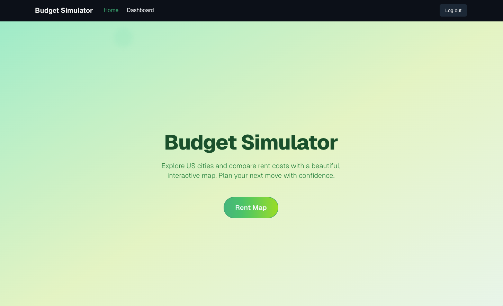
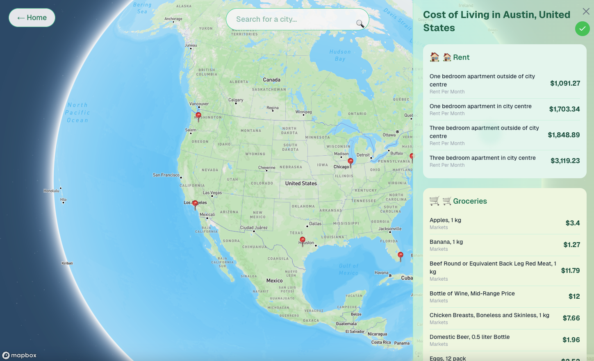
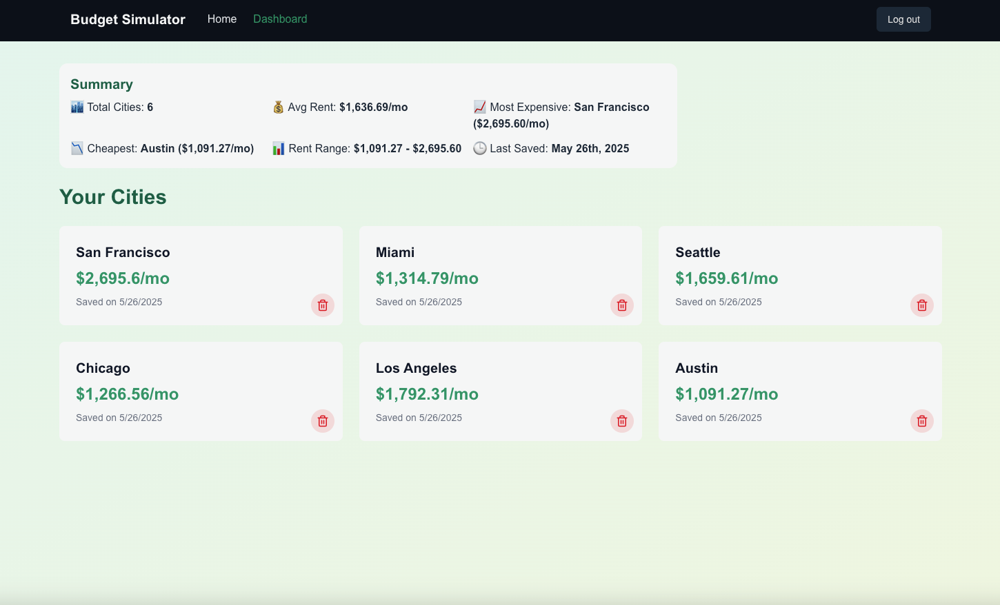

# Budget Simulator

Explore and compare rent costs across US cities with a beautiful, interactive map and personalized dashboard.  
**Live Demo:** [https://budget-simulator-mp123.vercel.app/](https://budget-simulator-mp123.vercel.app/)

---

## 🚀 Features

- **Interactive US Map:** Click any city to view detailed cost-of-living data.
- **Real-Time Rent Estimates:** Powered by the RapidAPI "Cost of Living and Prices" API.
- **User Authentication:** Sign in with Google (Supabase Auth).
- **Save & Manage Cities:** Add cities to your dashboard, compare, and remove them instantly.
- **Dashboard Summary:** See total cities, average rent, most/least expensive city, and last saved.
- **Optimistic UI:** Instant feedback when adding/removing cities—no refresh needed.
- **Persistent State:** Saved cities and stats sync across devices and sessions.
- **Modern UI:** Responsive, glassmorphism navigation, smooth transitions, and beautiful cards.

---

## 🖼️ Screenshots

### Home Page


### Interactive Rent Map


### Dashboard & Stats


---

## 🧩 Main Components & Structure

```
src/
├── app/
│   ├── (main)/dashboard/      # User dashboard (with summary stats)
│   ├── (main)/rent-map/       # Interactive rent map page
│   ├── api/                   # API routes (rentEstimate, etc.)
│   └── layout.tsx             # App layout
├── components/
│   ├── DashboardStats.tsx     # Dashboard summary statistics
│   ├── CityCard.tsx           # Saved city card (with remove)
│   ├── CityCostCard.tsx       # City cost-of-living modal/card
│   ├── SaveCityButton.tsx     # Add/save city button
│   ├── USMap.tsx              # Interactive US map
│   ├── NavBar.tsx             # Glassmorphism navigation bar
│   └── NavBarWrapper.tsx      # Conditional NavBar rendering
├── hooks/
│   ├── useSavedCities.ts      # Saved cities state & optimistic updates
│   ├── SavedCitiesContext.tsx # Shared context for saved cities
│   └── useUser.ts             # Supabase user/auth hook
├── lib/
│   ├── supabaseClient.ts      # Supabase client (browser)
│   └── supabaseServer.ts      # Supabase client (server)
├── data/
│   └── usCities.json          # Static city data for dev
└── public/
    ├── dashboard.png
    ├── homePage.png
    └── mapPage.png
```

---

## 🛠️ Getting Started

### Prerequisites

- Node.js (LTS recommended)
- pnpm, npm, or yarn
- Mapbox access token
- RapidAPI Cost of Living API key
- Supabase project (with Google Auth enabled)

### Installation

1. **Clone the repository:**
   ```bash
   git clone https://github.com/yourusername/budget-simulator.git
   cd budget-simulator
   ```

2. **Install dependencies:**
   ```bash
   pnpm install
   # or
   npm install
   # or
   yarn install
   ```

3. **Set up environment variables:**
   Create a `.env.local` file:
   ```
   NEXT_PUBLIC_MAPBOX_TOKEN=your_mapbox_token
   NEXT_PUBLIC_RAPIDAPI_KEY=your_rapidapi_key
   NEXT_PUBLIC_SUPABASE_URL=your_supabase_url
   NEXT_PUBLIC_SUPABASE_ANON_KEY=your_supabase_anon_key
   ```

4. **Start the development server:**
   ```bash
   pnpm dev
   # or
   npm run dev
   # or
   yarn dev
   ```

   Visit [http://localhost:3000](http://localhost:3000)

---

## 🏗️ Key Features Explained

- **DashboardStats:**  
  At the top of your dashboard, see a summary of your saved cities: total, average rent, most/least expensive, rent range, and last saved.

- **Optimistic UI:**  
  When you add or remove a city, the UI updates instantly—no waiting for a server round-trip.

- **Shared State:**  
  All city add/remove actions are synced across the rent map and dashboard using a React context provider.

- **Supabase Integration:**  
  - Auth: Google sign-in/out
  - Database: Each user's saved cities are stored in a Postgres table with RLS for security.

- **API Caching:**  
  City cost-of-living data is cached locally (dev) or in Supabase Storage (prod) for fast, low-cost lookups.

---

## 🌐 Live Demo

Try it now:  
👉 [https://budget-simulator-mp123.vercel.app/](https://budget-simulator-mp123.vercel.app/)

---

## 🤝 Contributing

1. Fork the repo
2. Create a feature branch (`git checkout -b feature/YourFeature`)
3. Commit your changes
4. Push and open a Pull Request

---

## 📄 License

MIT

---

## 🙏 Acknowledgments

- [Mapbox](https://www.mapbox.com/)
- [Supabase](https://supabase.com/)
- [RapidAPI Cost of Living](https://rapidapi.com/)
- [Next.js](https://nextjs.org/)
